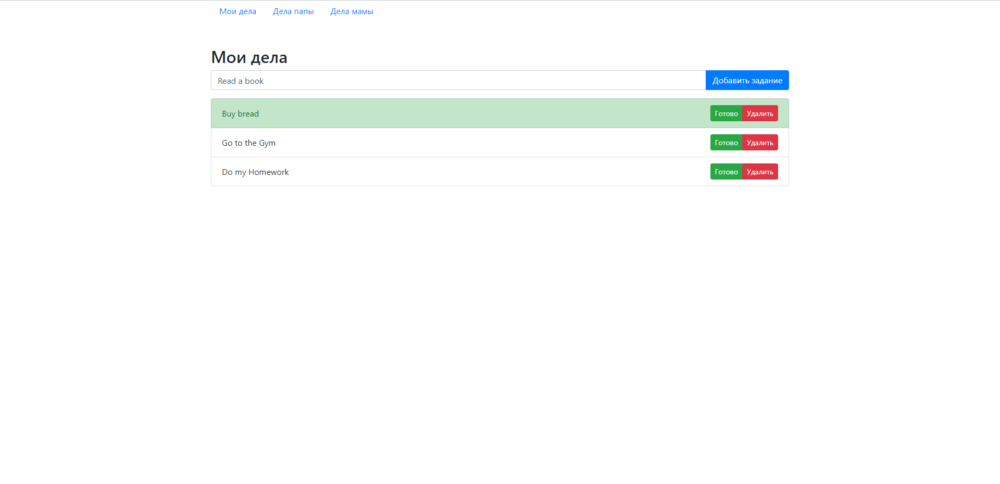

# Simple ToDo App

Basic ToDo application that allows multiple users to create their individual lists of tasks. Each task has two states - "completed" or "not completed". A user has an opportunity to manage the task state and highlight it. The application allows a user to delete any task. All task lists are stored in localStorage, which allows a user to save his tasks and return back later.

## Deployment

To deploy the app - simply pull the repository and open **index.html** from **src** folder

## View:

